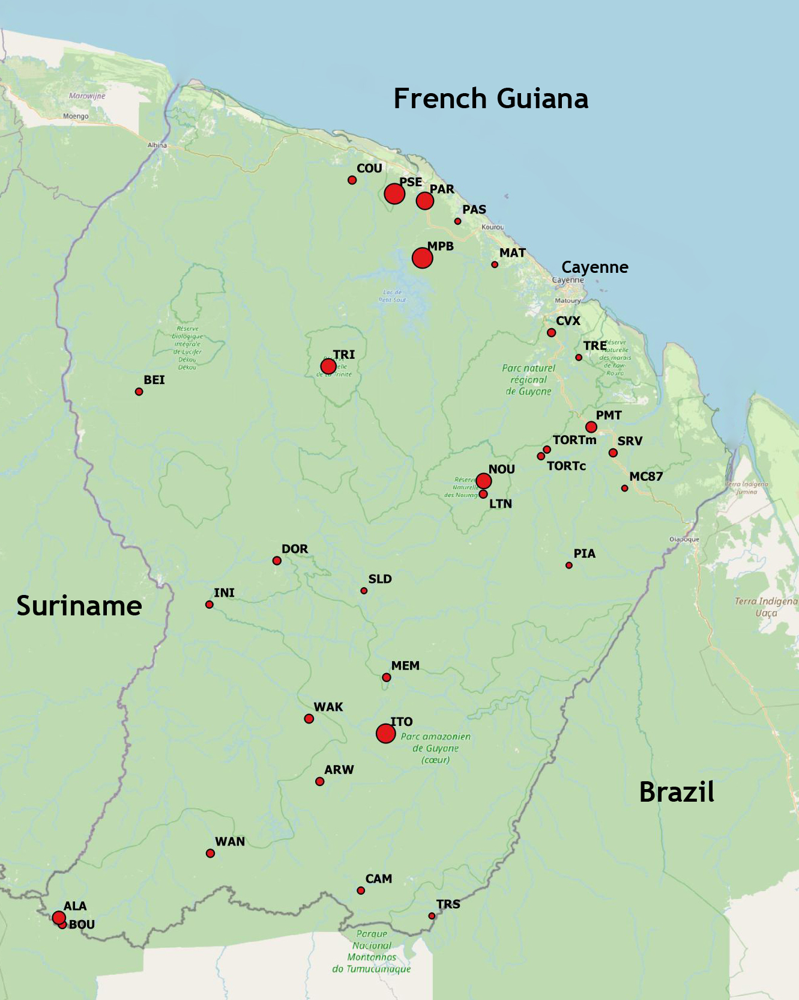

```{r DoNotModify, include=FALSE}
### Utilities. Do not modify.
# Installation of packages if necessary
InstallPackages <- function(Packages) {
  InstallPackage <- function(Package) {
    if (!Package %in% installed.packages()[, 1]) {
      install.packages(Package, repos="https://cran.rstudio.com/")
    }
  }
  invisible(sapply(Packages, InstallPackage))
}

# Basic packages
InstallPackages(c("bookdown", "formatR", "kableExtra", "ragg"))

# kableExtra must be loaded 
if (knitr::opts_knit$get("rmarkdown.pandoc.to") == "docx") {
  # Word output (https://stackoverflow.com/questions/35144130/in-knitr-how-can-i-test-for-if-the-output-will-be-pdf-or-word)
  # Do not use autoformat (https://github.com/haozhu233/kableExtra/issues/308)
  options(kableExtra.auto_format = FALSE)
}
library("kableExtra")

# Chunk font size hook: allows size='small' or any valid Latex font size in chunk options
def.chunk.hook  <- knitr::knit_hooks$get("chunk")
knitr::knit_hooks$set(chunk = function(x, options) {
  x <- def.chunk.hook(x, options)
  ifelse(options$size != "normalsize", paste0("\n \\", options$size,"\n\n", x, "\n\n \\normalsize"), x)
})
```

```{r Options, include=FALSE}
### Customized options for this document
# Add necessary packages here
Packages <- c("ade4", "broom", "dbmss", "entropart", "secret", "tidyverse")
# Install them
InstallPackages(Packages)

# knitr options
knitr::opts_chunk$set(
  cache=TRUE, # Cache chunk results
  echo=FALSE, # Show/Hide R chunks
  warning=FALSE, # Show/Hide warnings
  message=FALSE, # Show/Hide messages
  # Figure alignment and size
  fig.align='center', out.width='80%',
  # Graphic devices (ragg_png is better than standard png)
  dev = c("ragg_png", "pdf"),
  # Code chunk format
  tidy=TRUE, tidy.opts=list(blank=FALSE, width.cutoff=50),
  size="scriptsize", knitr.graphics.auto_pdf=TRUE
  )
options(width=50)

# ggplot style
library("tidyverse")
theme_set(theme_bw())
theme_update(panel.background=element_rect(fill="transparent", colour=NA),
             plot.background=element_rect(fill="transparent", colour=NA))
knitr::opts_chunk$set(dev.args=list(bg="transparent"))

# Random seed
set.seed(973)
```

# Introduction

Biodiversity assessment in tropical moist forests is a practical challenge but a major goal considering they are the most diverse terrestrial ecosystems.
Estimating the number of tree species is made possible by the long-term effort of sampling resulting in thousands of forest plots organized in various networks. 
In French Guiana, the GuyaDiv network consists of close to 250 plots across the whole forest.
Based on similar datasets, the diversity of tree species has been estimated in Amazonia [@TerSteege2013; @TerSteege2020] and at the world scale [@Slik2015].
The methods used in those studies are not appropriate to estimate regional diversity, i.e. at a smaller scale where dispersal limitation is critical.
The contribution of this paper is to estimate the number of tree species at the regional scale, in French Guiana (8 million hectares of tropical moist forest with no ecological boundary to distinguish them from the rest of Amazonia) and demonstrate which method is valid to do so.
We build on Harte's self similarity model [@Harte1999] that implies the power-law relationship of @Arrhenius1921 and provides a technique to evaluate its parameters [@Harte1999a], previously applied by @Krishnamani2004 in the Western Ghats, India.
We show that the log-series model underlying the work of @TerSteege2013 does not apply at the regional scale.

# Methods

```{r vault}
library("tidyverse")
# Decrypt the vault
library("secret")
name_project <- "GF-Richness"
vault <- "vault"
Sys.setenv(USER_KEY = usethis::proj_path(paste0(name_project, ".rsa")))
```

Self-similarity [@Harte1999] is a property based on scale invariance.
Consider a species that is present in an area $A_0$, say French Guiana.
The probability to find it in half the whole area, denoted $A_1$ is $a$.
Then, if it is present $A_1$, the probability to find it in turn in half $A_1$, denoted $A_2$, is also $a$, and so on.
The probability to find the species in $A_n$ is thus $a^n$.
In other words, the conditional probability to find a species in a sub-area, given that it is present in the area containing it, is constant: it does not depend either on the observation scale nor the species considered.

The Arrhenius power law [@Arrhenius1921] both implies and is a consequence of the self-similarity property [@Harte1999].
The number of species $\mathrm{S}(A)$ observed in an area $A$ is

\begin{equation}
  \mathrm{S}(A)=cA^z
  (\#eq:Arrhenius)
\end{equation}

where $z$ is the power parameter and $c$ is the number of species in an area of size 1.
Actually, $a=2^{-z}$.
This is a classical relation in macroecology, with long empirical and theoretical support [@Williamson2001; @GarciaMartin2006].

If $z$ is known, the inventory of a reasonably large area $b$ allows computing $c=b^{z}/S(b)$.
Then, $\mathrm{S}(A)$ can be calculated for any value of $A$.

@Harte1999a showed that under the assumption of self-similarity, $z$ can be inferred from the dissimilarity between small and distant plots of equal size distributed across the area.
The @Sorensen1948 similarity between two plots is

\begin{equation}
  \chi = 2 (S_1 \cap S_2) / (S_1 + S_2)
  (\#eq:Sorensen)
\end{equation}

where $S_1$ (respectively $S_2$) is the number of species in plot 1 (resp. plot 2) and $S_1 \cap S_2$ is the number of common species.

Applied to plots of the same size separated by distance $d$, Sørensen's similarity decreases with distance following the relation $\chi \sim d^{-2z}$ [@Harte1999a] that can be estimated by the linear model

\begin{equation}
  \log(\chi) \sim \log(d).
  (\#eq:estimatez)
\end{equation}

The logarithm of the Sørensen dissimilarity between pairs of plots can be regressed against the logarithm of the distance between the plots: the slope of the regression is $-2z$.

The relation \@ref(eq:estimatez) holds at the same scale as the power law, i.e. at the regional scale [@Grilli2012].
@Krishnamani2004 estimated $z \approx 0.12$ with a very good fit to the linear model at distances up from 1 km but not below.

```{r GuyaDiv}
# Plots: code, location, X, Y
Plots <- get_secret("Plots", vault = vault)
# Abundances of species in each plot
Abundances <- get_secret("Abundances", vault = vault)
# Eliminate undetermined species
cf <- grepl("cf.", colnames(Abundances))
Abundances <- Abundances[, !cf]
# Number of plots
guyadiv_plots <- nrow(Plots)
# Number of locations
guyadiv_locations <- length(unique(Plots$Location))
```

A large enough inventory, provided by a permanent forest facility, is necessary along with a set of small, widely spread forest plots.
Our plot network is GuyaDiv [@Engel2015].
Since the installation of the first plots in 1986, the GuyaDiv network has continuously grown until today. 
It now consists of 243 plots of various sizes and shapes, distributed in various forest types, in 30 sites across French Guiana (figure \@ref(fig:GuyaDivMap)). 
We took into account the `r guyadiv_plots` one-hectare plots of the network. 
They are located in `r guyadiv_locations` sites, which provides fairly good coverage of the variability of the forest in French Guiana.

(ref:GuyaDivMap) The GuyaDiv network. Paracou, Piste de Saint-Elie and Nouragues are denoted PAR, PSE and NOU.
```{r GuyaDivMap, fig.cap="(ref:GuyaDivMap)"}

```

We gathered 3 local, large inventories to account for environmental variability and a network of plot covering the whole region.

```{r Paracou, eval=FALSE}
# Extrapolation of species with confidence >=2 in the database
# All plots
paracou_area <- (15*6.25+25)/100
paracou_envelope <- 3.5
# From Paracou database
# Abundances of species in each plot
Paracou_abd <- get_secret("Paracou_abd", vault = vault)
# Extrapolate richness to the envelope area
library("entropart")
paracou_S <- round(Diversity(Paracou_abd, q=0, 
                Level=round(paracou_envelope/paracou_area*sum(Paracou_abd))))
```

```{r b}
# Number of species and envelope area
paracou_S <- 571+575-443+37
paracou_envelope <- 4.84
PSE_S <- 763
PSE_envelope <- 3
NOU_S <- 850
NOU_envelope <- 2.5
```

The Paracou research station [@Gourlet-Fleury2004] contains six 6.25-ha and one 25-ha plots of primary rainforest.
Nine 6.25-ha plots were logged between 1986 and 1988 in a forestry experiment that temporarily increased the recruitment of light-demanding species [@Mirabel2021] and the functional diversity [@Mirabel2020].

In a rather conservative approach, we retained only the well-identified trees of the permanent plots (571 species) and added available data from the GuyaDiv network: transects from @Molino2001 and ten 0.49-ha plots around the Guyaflux tower [@Bonal2008] contain 575 species, including 132 new ones.
37 more species at the French Guiana IRD Herbarium [CAY: @Gonzalez2022] were collected in the area but outside the plots.
The total number of species is thus `r paracou_S` included in a `r paracou_envelope`-km^2^ convex envelope.

The Piste de Saint-Elie site has been intensively sampled for 50 years.
It encompasses nineteen 1-ha and one half-hectare plots in GuyaDiv and a few small plots added for various studies.
Moreover, many herbarium specimen were collected from the site.
As a whole, we gathered `r PSE_S` species in a `r PSE_envelope`-km^2^ area.

Nouragues research station [@Bongers2001] provides 22 hectares of permanent plots curated the same way as Paracou's in a common network called Guyafor.
We applied the same protocol, adding 11 Guyadiv plots and herbarium collections up to `r NOU_S` species in a `r NOU_envelope`-km^2^ area.

```{r n_simulations}
# Number of simulations to run
n_simulations <- 1000L
```

The number of plots varies across locations so the estimation of $z$ must be made with care.
We sampled one random plot at each location to obtain $`r guyadiv_locations` \times `r guyadiv_locations-1`/2 = 210$ pairs of plots.
We calculated the Sørensen dissimilarity $\chi$ and the geographic distance $d$ between each pair of plots.
We estimated $z$ as half the coefficient of the distance variable in the linear model $\log(\chi) \sim \log(d)$.
We repeated these steps `r n_simulations` times to obtain a distribution of estimated $z$ values depending on the plots drawn in each location.
$z$ was estimated as the empirical mean of the distribution and its 95% confidence interval was obtained by eliminating the 2.5% extreme values on both tails.

```{r FrenchGuiana}
# Extrapolation area in squared km
A0 <- 80000
```

The confidence interval of the estimation of the number of species is assessed by combining the uncertainty in $c$ and $A^z$.
The variance of $c$ is estimated from the three observed values.
That of $A^z$ is obtained from the empirical distribution of $z$.
The variance of their product is calculated (the formula and its derivation are in Appendix \@ref(apd-variance)).
Finally, we assumed the normality of the distribution of the product of the estimates to retain an approximate 95% confidence interval of $\pm$ 2 standard deviations.

All analyses were made with R [@R] v. 4.1.2.


# Results

```{r estimate_z}
library("ade4")
library("broom")
library("dbmss")
# estimate_z selects one random plot per location,
# estimates log(Sorensen) ~ log(Distance)
# and returns z
estimate_z <- function() {
  # Select one plot per location...
  Plots %>% 
    # Set a random value to each plot
    mutate(Random=runif(n())) -> 
    RandomizedPlots
  RandomizedPlots %>% 
    group_by(Location) %>%
    # Select the plot with the max random value in each location
    summarize(MaxRandom=max(Random)) %>% 
    rename(Random=MaxRandom) %>% 
    # Eliminate non-selected plots
    inner_join(RandomizedPlots) %>% 
    # Suppress messages from GH Action logs
    suppressMessages %>% 
    select(Plot) -> 
    SelectedPlots
  # Calculate distances
  Plots %>% 
    # Selected plots only
    inner_join(SelectedPlots) %>%
    # Suppress messages from GH Action logs
    suppressMessages %>% 
    rename(PointName=Plot, X=X_UTM, Y=Y_UTM, PointType=Location) %>% 
    mutate(PointWeight=1) %>% 
    # Create a weighted, marked planar point pattern (dbmss)
    wmppp(unitname = c("meter", "meters")) %>% 
    suppressWarnings %>% 
    # Calculate distances between pairs of plots
    pairdist() %>% 
    # Make a dist object (ade4)
    as.dist -> 
    Distances
  # Calculate Sorensen divergence
  Abundances %>% 
    # Selected plots only
    inner_join(SelectedPlots) %>% 
    # Suppress messages from GH Action logs
    suppressMessages %>% 
    select(-Plot) %>% 
    # Calculate Sorensen dissimilarity
    dist.binary(method = 5) -> 
    Sorensen
  # Sorensen similarity
  Sorensen <- 1-Sorensen
  # Regress log(Sorensen) ~ log(Distance)
  tibble(Sorensen=as.numeric(log10(Sorensen)), 
         Distance=as.numeric(log10(Distances))) %>% 
    # Distances over 1km
    dplyr::filter(Distance > log10(0.8)) %>% 
    # Estimate the model
    lm(Sorensen~Distance, data=.) %>% 
    # Extract the slope
    tidy %>% 
    dplyr::filter(term == "Distance") %>% 
    select(estimate) %>% 
    pull -> 
    slope
  # z is negative half the slope
  z <- -slope/2
  return(z)
}
```

```{r bootstrap_z}
if (interactive()) {
  # Prepare a progress bar
  pgb <- txtProgressBar(min=0, max=n_simulations)
  # To store bootstrapped z values
  sim_z <- rep(0, n_simulations)
  # Run simulations
  for (i in 1:n_simulations) {
    sim_z[i] <- estimate_z()
    setTxtProgressBar(pgb, i)
  }
} else {
  # Compact code
  sim_z <- replicate(n_simulations, estimate_z())
}

# Statistics
z <- mean(sim_z)
z_sigma <- sd(sim_z)
alpha <- 0.05
z_ci <- quantile(sim_z, probs = c(alpha/2, 1-alpha/2))
# Not retained: standard error of the mean
# z_ci <- qt(1-alpha/2,
#           df=guyadiv_locations*(guyadiv_locations-1)/2 -2) *
#  z_sigma / sqrt(n_simulations)

# Plot the distribution of z
# entropart::as.SimTest(z, sim_z) %>% autoplot
```

The estimated value of $z$ is `r z %>% round(3) %>% format(nsmall=3)` with a 95% confidence interval between `r z_ci[1] %>% round(3) %>% format(nsmall=3)` and `r z_ci[2] %>% round(3) %>% format(nsmall=3)`.

```{r estimate_c}
# From 3 sites
c_paracou <- paracou_S/paracou_envelope^z
c_PSE <- PSE_S/PSE_envelope^z
c_NOU <- NOU_S/NOU_envelope^z
c_est <- (c_paracou + c_PSE + c_NOU)/3
```

The estimated number of species per squared kilometer, $c$, is respectively `r c_paracou %>% round(0)`, `r c_PSE %>% round(0)` and `r c_NOU %>% round(0)` in Paracou, Piste de Saint-Elie and Nouragues.
The average value is `r c_est %>% round(0)`.

```{r estimate_S}
# Estimated number of species
S <- c_est * A0^z
# Confidence interval
var_Az <- var(A0^sim_z)
e_Az <- mean(A0^sim_z)
var_c <- var(c(c_paracou, c_PSE, c_NOU))
var_S <- c_est^2*var_Az + e_Az^2*var_c + var_Az*var_c
sigma_S <- sqrt(var_S)
```

Finally, the estimated number of species is `r S %>% round(0)`.
Taking into account the uncertainty about $z$, its 95% confidence interval is between `r (S-2*sigma_S) %>% round(0)` and `r (S+2*sigma_S) %>% round(0)`.

# Discussion

The self-similarity model allows estimating the number of species of tropical forests at a regional scale.
It requires a network of plots at a wide range of distances from each other to estimate Arrhenius's power law parameter.
It should be completed by a continuous inventory whose size is consistent with the smallest scale of the power law.
These constraints explain why the method has not been widely applied, beyond @Krishnamani2004 and this paper.

At smaller scales, i.e. inside a single community, the relation between area and number of species is described by species accumulation curves [SAC: @Gotelli2001].
It is driven by statistical models that address incomplete sampling [@Shen2003; @Beguinot2015a].
After replacing the sampled area by the number of individuals it contains, well-known estimators of richness such as Chao's [@Chao2004] or the jackknife [@Burnham1978] apply.
This estimation is in appendix \@ref(apd-npe).
It is less than 1700 species, i.e. less than the total number of known species [@Molino2022].
As already underlined by @TerSteege2013, this method is not appropriate at large scales because of severe undersampling: many local communities are just not included in the data.

At the scale of the metacommunity, defined as of the neutral model of biogeography, the species distribution is in log-series [@Hubbell2001; @Volkov2003].
@TerSteege2013 fitted a log-series to data provided by a network of plots to estimate the number of species in Amazonia.
We applied the same method to our data in appendix \@ref(apd-logseries).
Its estimation is close to 3500 species in French Guiana: a very unlikely result according to the current expert knowledge and the recent checklist [@Molino2022].
The regional species pool does not follow a log-series distribution because of dispersal limitation [@Grilli2012].
In other words, the regional community is not a sample of the metacommunity: many of the metacommunity's species are not present.
As a consequence, the log-series estimation of the richness of a regional species pool leads to severe overestimation.
For the same reasons, hyperdominance is less pronounced: 4% of the species contain half the trees (apendix \@ref(apd-hyperdominance)), compared to 1.4% in Amazonia as a whole [@TerSteege2013].

The estimated number of tree species in the 8-million-hectare forest of French Guiana is close to `r round(S/100)*100`, with a quite wide confidence interval due to the variability in the estimation of both the number of trees in a squared kilometer and the power-law parameter.

As shown in figure \@ref(fig:slope), the fit of the linear model is not perfect.
The theory does not address habitat variation, that is well-described in French Guiana [@Guitet2015b].
The dissimilarity between plot pairs is thus explained by distance and habitat dissimilarity, the latter ignored in the model.
Yet, the estimation of $z$ is quite robust because the GuyaDiv network covers a wide range of habitats, allowing to cancel out local variability.
Adding more plots or describing a few more species in the previous plots may not change $z$ significantly since it is obtained from the dissimilarity between plots.
Its value `r z %>% round(3) %>% format(nsmall=3)` is in line with that of @Krishnamani2004 in another tropical forest: it is very small compared to the classical 0.25 of @Arrhenius1921 or 0.263 of @Preston1962. 
This was discussed by @MacArthur1967, chapter 2.
The power law applies to embedded scales of the same ecosystem here, in contrast to the usual sets of isolated islands providing the data [@Triantis2012]: in our case, the number of species increases less with the area, leading to smaller $z$ values.

The critical aspect of the estimation is the accuracy of the starting point of the extrapolation, that mainly depends on the representativeness of the local inventories
Again, the self-similarity model assumes that $c$, the number of species per squared kilometer, is the same everywhere.
Local, observed values must be understood as variations around the real $c$, that should be estimated by replicating inventories across the whole region.
This is of course restricted by the huge resources needed to settle a single one: three replicates are an exceptional amount of data.
Paracou, Piste de Saint-Elie and Nouragues represent quite well the variability of local richness of the forest of French Guiana.
We made a strict selection of the data to count the numbers of species, which are thus lower bounds.
Ongoing efforts of botanists may increase a bit the value of $c$, implying a proportional increase in the estimation of the number of species.

A recent work [@Molino2022] lists nearly 1800 species of indigenous trees in French Guiana, based on herbarium collections on the one hand, and on data from the GuyaDiv and GuyaFor plot networks [@Engel2015] on the other. 
However, this checklist is only a state of the art of our knowledge of the tree flora. 
Even in the most intensively explored areas, botanists conducting botanical inventories have identified a number of entities that are morphologically distinct from all known species in French Guiana, and which they therefore consider to be still unnamed species. 
They gave them provisional names (e.g. *Pouteria* sp. A), until more information is available to either recognize species known in other parts of the world, or to describe them and give them a valid name according to the Code of Nomenclature. 
The GuyaDiv and GuyaFor databases together currently list more than 300 of these unnamed species, but @Molino2022 selected only 144 of them for their checklist, the ones that were best characterized and best illustrated by good quality herbarium specimens. 
Although it cannot be excluded that some of the other 150-200 unnamed species are in fact simple morphological variants of already described species, they believe that most of them represent distinct species. 
In other words, the number of known species in French Guiana (named and unnamed) is probably already close to 2000. 
Furthermore, the available data is very unevenly distributed across the territory. 
The south and especially the north-west of French Guiana are poorly explored botanically (few inventory plots, relatively few herbarium specimens), while their floras are significantly different from the better inventoried northern and central zones. 
It is thus very likely that the exploration of these little-known areas will add new species to the list. 
Therefore, the estimate of `r S %>% round(0)` spp. given here seems quite plausible, given the state of our knowledge.
 

# Appendix

## Similarity distance decay

The relation between Sørensen's similarity and distance is presented in figure \@ref(fig:slope).
All pairs of plots more than 800 meters apart (the scale of Paracou's 0.625-km^2^ inventory) are shown.
The estimation of $z$ is not made this way because some locations contain more plots than others so their weight is increased.
The technique used in the text of the paper consists of drawing a random plot in each location to estimate $z$, and repeat this process a large number of times to estimate the expectation of $z$.

(ref:slope) Relation between Sørensen's similarity and the distance between pairs of plots. Both axes are in base-10 logarithms, distances are in meters. Each point is a pair of plots more than 800 m apart, up to 377 km. A linear model is fitted: the slope of the regression is $-2z$.
```{r slope, fig.cap="(ref:slope)"}
library("ade4")
library("dbmss")

# Calculate distances between plots
Plots %>% 
  rename(PointName=Plot, X=X_UTM, Y=Y_UTM, PointType=Location) %>% 
  mutate(PointWeight=1) %>% 
  # Create a weighted, marked planar point pattern (dbmss)
  wmppp(unitname = c("meter", "meters")) %>% 
  suppressWarnings %>% 
  # Calculate distances between pairs of plots
  pairdist() %>% 
  # Make a dist object (ade4)
  as.dist -> 
  Distances

# Calculate Sorensen's similarity
Abundances %>% 
  select(-Plot) %>% 
  # Calculate Sorensen dissimilarity
  dist.binary(method = 5) -> 
  Sorensen
# similarity
Sorensen <- 1-Sorensen

# Regress log(Sorensen) ~ log(Distance)
tibble(Sorensen=as.numeric(log10(Sorensen)), 
       Distance=as.numeric(log10(Distances))) %>% 
  # Distances over 1km
  dplyr::filter(Distance > 3) %>% 
  ggplot(aes(x=Distance, y=Sorensen)) +
    geom_point() +
    geom_smooth(method = lm)
```


## Variance of the product of two independent random variables {#apd-variance}

Let $X$ and $Y$ two random variables, here the estimators of $c$ and $A^z$.

The variance of their product $XY$ is

\begin{equation} 
  \begin{split}
    \mathrm{Var}(XY) &= \mathbb{E}(X^2Y^2) -\mathbb{E}^2(XY) \\
                     &= \mathbb{E}(X^2)\mathbb{E}(Y^2) +\mathrm{Cov}(X^2,Y^2) \\
                     &\quad -[\mathbb{E}(X)\mathbb{E}(Y) +\mathrm{Cov}(X,Y)]^2.
  \end{split}
  (\#eq:varprod)
\end{equation}

If $X$ and $Y$ are independent (this applies to $c$ and $A^z$), covariances are 0 and the variance reduces to

\begin{equation} 
  \begin{split}
    \mathrm{Var}(XY)&= \mathbb{E}(X^2)\mathbb{E}(Y^2) -[\mathbb{E}(X)\mathbb{E}(Y)]^2 \\
                    &= [\mathrm{Var}(X)+\mathbb{E}(X)^2][\mathrm{Var}(Y)+\mathbb{E}(Y)^2] \\
                    &\quad -[\mathbb{E}(X)E(Y)]^2 \\
                    &= \mathrm{Var}(X)\mathrm{Var}(Y) \\
                    &\quad +E(X)^2\mathrm{Var}(Y) +E(Y)^2\mathrm{Var}(X).
  \end{split}
  (\#eq:varprodind)
\end{equation}


## Non-parametric estimation of the number of species {#apd-npe}

```{r jackknife}
library("entropart")
Community <- colSums(Abundances[, -1])
S_best <- Richness(Community)
S_Chao1 <- Richness(Community, Correction="Chao1")
```

Assuming that the plots are sample of a single community, the estimation of richness relies on the well-known non-parametric estimators.
The observed number of species is `r sum(Community>0)` among which `r sum(Community==1)` and `r sum(Community==2)` are sampled once and twice.
The lower-bound estimation of the number of species by the Chao1 estimator is `r S_Chao1`. 
The best jackknife estimator (of order 3) is `r S_best`.


## Log-series estimation of the number of species {#apd-logseries}

Assuming that the plots are samples of a metacommunity that follows a log-series distribution, the rank-abundance curve can be extrapolated (figure \@ref(fig:logseries)) following @TerSteege2013.

```{r n_trees}
# Number of trees = area x number of trees per 1-ha plot
n_trees <- round(A0 * 100 * mean(colSums(Abundances[, -1])))
```

First, the total number of trees is estimated by extrapolation of the average number of trees per plot.
There are close to `r round(n_trees/1E6)` million trees in French Guiana.

The probability for one of these trees to belong to a given species is obtained by averaging the probability of the species among plots.
Each plot is a sample of a local community whose composition is not completely known: for example, many rare species are not in the sample.
The observed frequency of a species in a plot is not the probability of the species in the community: frequencies sum up to 1 while the sum of the actual probabilities of observed species, called the sample coverage [@Good1953], sums up to 1 minus that of the unobserved species.
The actual probabilities of observed species can be estimated following @Chao2015, with the *entropart* package [@Marcon2014c].

```{r chao2015}
p_est_plots <- as.data.frame(Abundances[, -1])
p_est_plots[, ] <- 0

library("entropart")
for (plot in seq_len(nrow(Abundances))) {
  p_est <- as.ProbaVector(as.AbdVector(Abundances[plot, -1]), Correction="Chao2015", Unveiling="None")
  p_est_plots[plot, names(p_est)] <- p_est
}

abd_est <- as.AbdVector(sort(n_trees * colMeans(p_est_plots), decreasing = TRUE))
```

The most abundant tree species is *`r names(abd_est[1])`* with around `r round(abd_est[1]/1E6)` million trees.

(ref:logseries) Extrapolation of the rank-abundance curve built from the GuyaDiv plots. Extrapolated abundances (in log scale) of observed species are plotted against the rank of their species. The abundances of unobserved species (the red curve) is extrapolated linearly from the center 50% of the distribution of the observed species. The rarest 25%, ignored for the extrapolation, are plotted as grey points.
```{r logseries, fig.cap="(ref:logseries)"}
# Central 50% of the curve
EA50 <- as.AbdVector(abd_est[round(length(abd_est)/4):round(length(abd_est)*3/4)])
x <- seq_along(EA50)
y <- as.numeric(log(EA50))

# Regress abundance ~ rank
EA50lm <- lm(y ~ x)

# Extrapolated number of species
n_species <- as.integer(-EA50lm$coefficients[1]/EA50lm$coefficients[2] + length(abd_est)/4 -1)

# Plot
EA75 <- abd_est[1:round(length(abd_est)*3/4)]
plot(abd_est, ylim=c(1, max(EA75)), xlim=c(0, n_species), col="grey")
points(EA75)
Extra <- exp(EA50lm$coefficients[1])*cumprod(rep(exp(EA50lm$coefficients[2]), n_species-round(length(abd_est)/4)+1))
lines(x=round(length(abd_est)/4):n_species, y=Extra, col="red")
```

The estimated number of species according to this model is `r n_species`.
This is undoubtedly a severe overestimation, see the discussion section of the paper.


## Hyperdominance {#apd-hyperdominance}

Hyperdominance is a characteristic of many distributions of species.
Figure \@ref(fig:hyperdominance) shows the accumulation of individuals from the most abundant to the rarest species.

(ref:hyperdominance) Accumulation of the number of individuals from the most abundant to the rarest species. The horizontal line corresponds to half the individuals. The vertical line allows reading the corresponding rank of the species.
```{r hyperdominance, fig.cap="(ref:hyperdominance)"}
# Hyperdominance
plot(cumsum(abd_est), ylim=c(0, n_trees), xlab="Rank", ylab="Cumulated Number of Trees", axes=FALSE)
axis(1, axTicks(1)+1)
axis(2)
box()
abline(h=n_trees/2, lty=2, col="red")
hdSpecies <- min(which(cumsum(abd_est)>n_trees/2))
abline(v=hdSpecies, lty=2, col="red")
```

Only `r hdSpecies` species, i.e. `r round(hdSpecies/S*100)`% of their estimated number, contain half the number of trees.


`r if (!knitr:::is_latex_output()) '# References {-}'`
